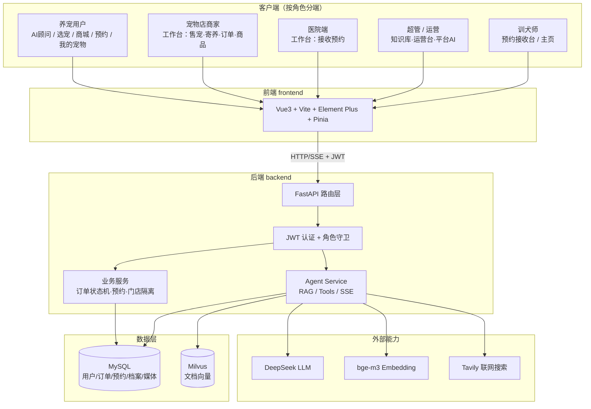
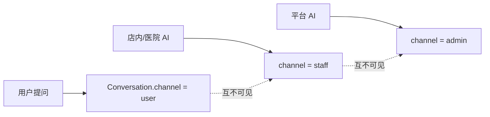
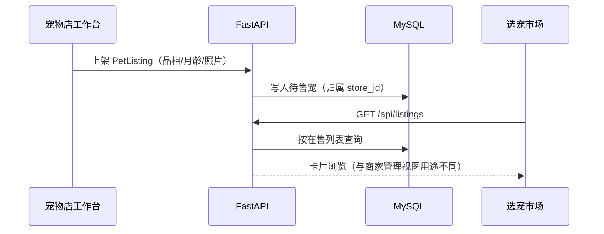
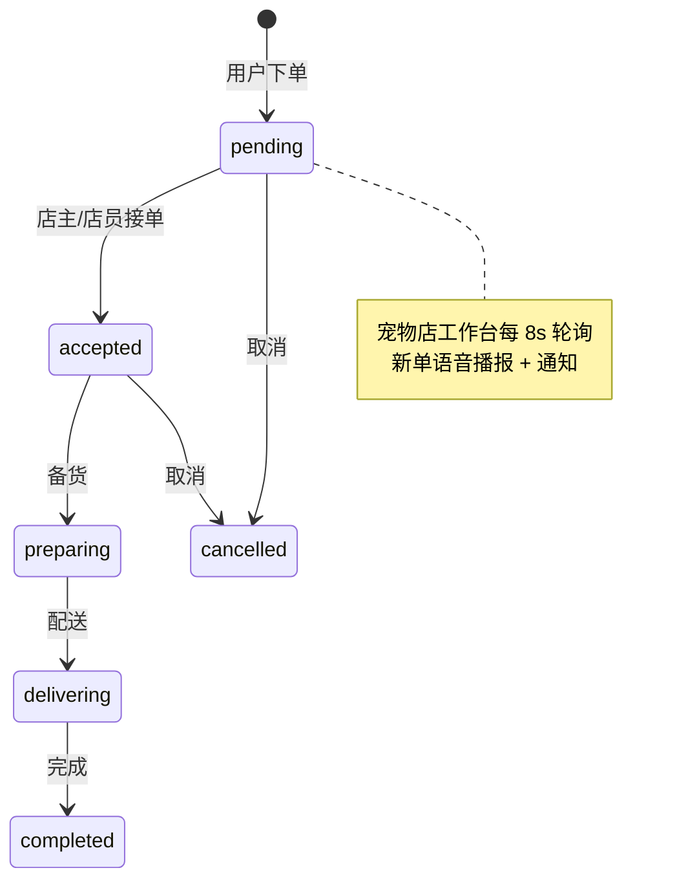
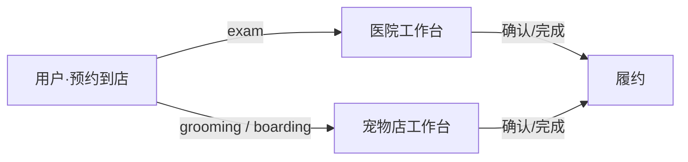
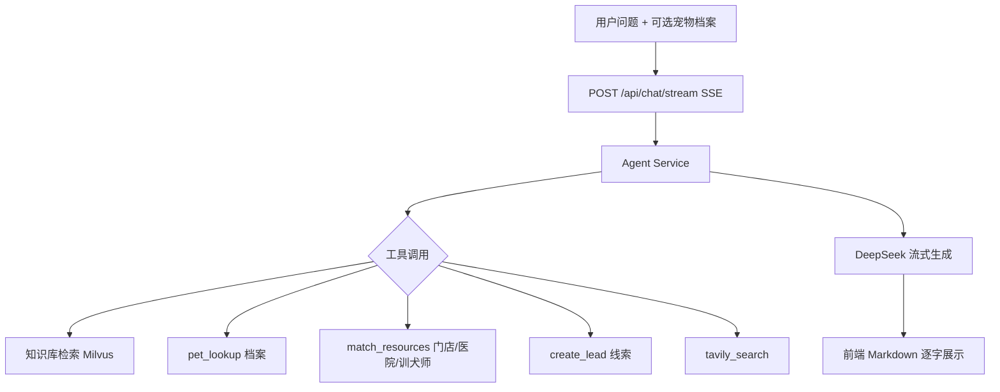
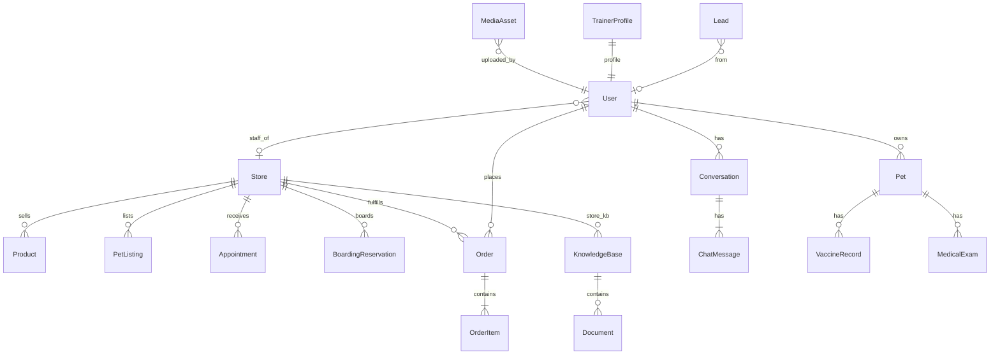
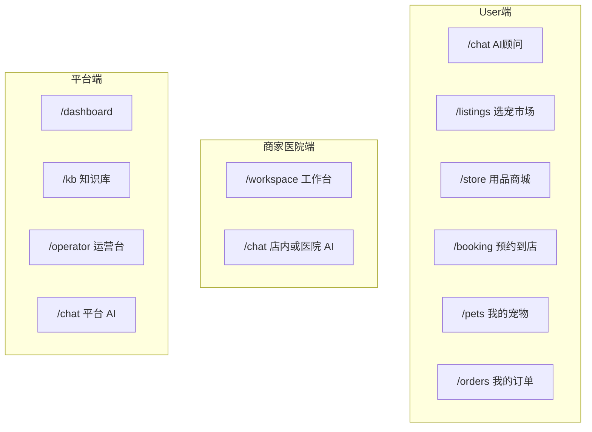

# 宠智联 — 整体架构说明

> 平台定位：连接养宠用户、宠物店、宠物医院、训犬师与运营者的多边 AI 服务平台。  
> 平台不自营商品与宠物库存，商品/待售宠由商家上架履约；AI 按角色隔离，互不串话。  
> 文档更新：2026-09-24

---

## 1. 一句话架构

```text
Vue3 前端 (:5173)
    │  JWT Bearer + REST / SSE
    ▼
FastAPI (:8000)
    ├── 认证鉴权（角色：user / staff / hospital / admin / operator / trainer）
    ├── 业务 API（宠物、商城、预约、订单、选宠、工作台、媒体…）
    ├── AI Agent（RAG + 工具调用 + DeepSeek 流式）
    └── 存储
         ├── MySQL（业务数据 + Base64 图片）
         └── Milvus（知识库向量）
```

---

## 2. 系统总览图



---

## 3. 角色与端隔离

| 角色 | 账号示例 | 主入口 | 能做什么 | 不能做什么 |
|------|----------|--------|----------|------------|
| 养宠用户 `user` | `demo_user` | AI 顾问 | 档案、选宠、商城下单、预约、订单 | 管店、上架商品 |
| 宠物店 `staff` + shop | `storeA_mgr` / `storeA_staff` | 门店工作台 | 待售宠、客户寄养、接收预约、商品与订单、店内 AI | 「我的宠物」、主动下预约 |
| 医院端 `staff` + hospital | `hospital_mgr` / `storeB_mgr` | 医院工作台 | 接收就诊预约、弹窗提醒 | 店员层级、售宠上架（按店型隐藏） |
| 超管 `admin` | `admin` | 平台工作台 | 公共知识库、运营台、平台 AI | 替商家上架商品 |
| 运营 `operator` | 注册 | 运营台 | 线索匹配 | 门店履约 |
| 训犬师 `trainer` | `trainer_demo` | 预约接收台 | 接收训练预约、维护主页/经历/证书证明图 | 专属 AI、门店库存 |

### AI 会话隔离



- 后端：`Conversation.channel` + 创建/列表按 channel 过滤  
- 前端：`localStorage` 按 `userId + channel` 分桶持久化  

---

## 4. 核心业务链路

### 4.1 用户选宠 / 商家售宠



- **商家侧**：工作台「待售宠物」= 上架管理  
- **用户侧**：选宠市场 = 浏览 / 询价入口，再走「预约到店」看宠  

### 4.2 商城下单（商家履约）



- 一单一店；库存扣减；平台不自营  
- 超管不可上架商品，仅本店 `staff` 可管商品  

### 4.3 预约（用户发起 → 商家/医院接收）



| 预约类型 | 应对门店类型 |
|----------|--------------|
| 就诊 exam | hospital |
| 美容 grooming | shop |
| 寄养 boarding | boarding / shop |
| 咨询 consult | hospital / shop |

- 商家**不能**自己下预约单，只处理用户提交的单  
- 医院端：新预约弹窗；宠物店：订单语音播报  

### 4.4 AI 顾问（RAG + 工具）



| 端 | 默认模式 | 知识来源 |
|----|----------|----------|
| 养宠用户 | 养宠咨询 pet | 公共养护库 + 当前宠物档案 |
| 商家/医院 | 制度助手 policy | 本店内容库 |
| 超管/运营 | 平台助手 | 公共/平台规范 |

回答超过约 3.5 秒未出字时，前端提示用户可先做其他事稍后再看。

---

## 5. 技术栈与目录

| 层 | 技术 |
|----|------|
| 前端 | Vue 3、Vite、Element Plus、Pinia、Vue Router、marked |
| 后端 | FastAPI、Tortoise ORM、uvicorn、httpx |
| 库 | MySQL、Milvus |
| AI | DeepSeek、sentence-transformers (bge-m3)、Tavily |
| 鉴权 | JWT + bcrypt |

```text
ai_agent/
├── backend/
│   ├── app/
│   │   ├── api/          # auth booking chat documents marketplace media
│   │   │                 # orders pets store workspace knowledge_base …
│   │   ├── core/         # config / security
│   │   ├── models/       # Tortoise 模型
│   │   ├── schemas/      # Pydantic
│   │   └── services/     # agent / rag / embedding / milvus / llm
│   ├── requirements.txt
│   └── uploads/          # 知识库文档落盘
├── frontend/
│   └── src/
│       ├── api/ views/ stores/ router/ layout/
├── docs/                 # 本架构文档
├── kb_docs_pet/          # 公共养宠知识语料
├── docker-compose.yml
└── README.md
```

---

## 6. 数据模型概览（业务域）



### 存储分工

| 存储 | 内容 |
|------|------|
| MySQL | 用户、门店、宠物档案、待售、商品、订单、预约、寄养、会话、线索、**MediaAsset（图片 Base64）** |
| Milvus | 文档 chunk 文本 + embedding，`kb_id` / `doc_id` 回指 MySQL |
| 本地 uploads | 知识库原始上传文件 |

图片对外 URL 形如 `/api/media/{id}`，卡片可直接 ``。

---

## 7. 前端信息架构



路由守卫：`/pets`、`/booking`、`/orders` 仅 `user`；商家访问选宠市场会跳回工作台。

---

## 8. 主要 API 分组

| 前缀 | 说明 |
|------|------|
| `/api/auth` | 注册登录、me、改密 |
| `/api/chat` | 同步/流式问答，会话按 channel 隔离 |
| `/api/pets` | 用户宠物档案、疫苗/体检/用药 |
| `/api/stores` `/api/stores/products` | 门店与商品（上架仅本店 staff） |
| `/api/orders` | 用户下单、本店履约 |
| `/api/booking` | 用户预约、寄养 |
| `/api/workspace` | 店端概览、预约处理、寄养、召回、本店 KB |
| `/api/listings` | 选宠市场 / 店内上架 |
| `/api/media` | 图片上传与读取 |
| `/api/kb` `/api/documents` | 知识库与文档（超管公共库） |

---

## 9. 本地启动

```bash
# 后端
cd backend
.\.venv\Scripts\python.exe -m uvicorn app.main:app --reload --host 127.0.0.1 --port 8000

# 前端
cd frontend
npm run dev
```

- 前端：http://localhost:5173/  
- 后端文档：http://127.0.0.1:8000/docs  

### 演示账号（密码除超管外均为 `Passw0rd!a`）

| 账号 | 身份 |
|------|------|
| `demo_user` | 养宠用户 |
| `storeA_mgr` / `storeA_staff` | A 店店主 / 店员 |
| `hospital_mgr` | 宠康医院端 |
| `storeB_mgr` | B 诊所医院端 |
| `trainer_demo` | 训犬师 |
| `admin` / `admin123` | 超管 |

---

## 10. 设计原则（当前产品约束）

1. **平台撮合，不自营**：商品与待售宠归属门店，平台做匹配与工具。  
2. **端职责清晰**：用户发起预约与下单；商家/医院只接收与履约。  
3. **商家无「我的宠物」**：仅有待售宠与**客户寄养**宠物。  
4. **医院一人一账号**：不设职工层级。  
5. **AI 按端隔离**：用户养宠问答不出现在商家/管理端。  
6. **管理端不上架商品**：上架归属商家工作台。  

---

## 修订记录

| 日期 | 说明 |
|------|------|
| 2026-09-24 | 以现行「宠智联」多边平台为准，重写架构文档，替换原 `stage3_design.md` |
| 2026-09-24 | 补齐用户↔宠物店↔医院闭环交互；消费端 UI 参考美团/淘宝（首页宫格、商品卡、橙色 CTA） |
