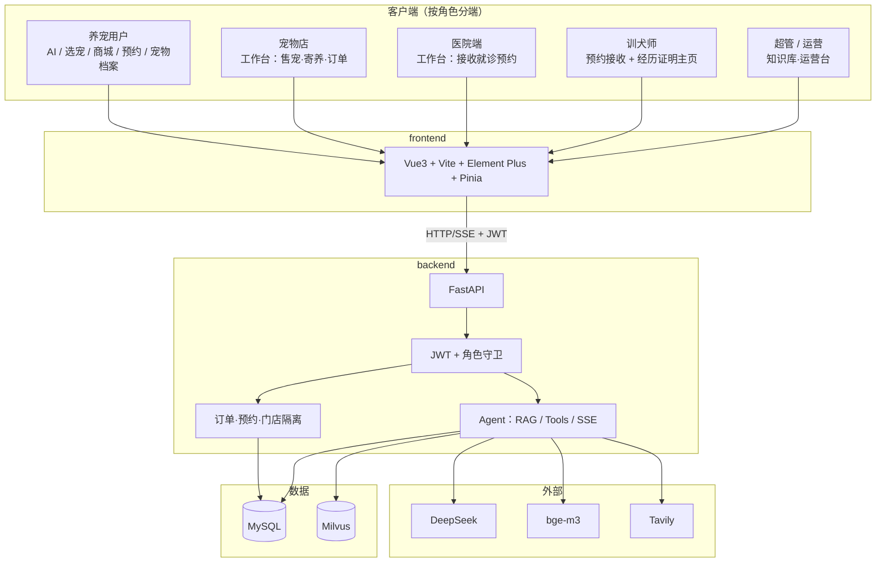
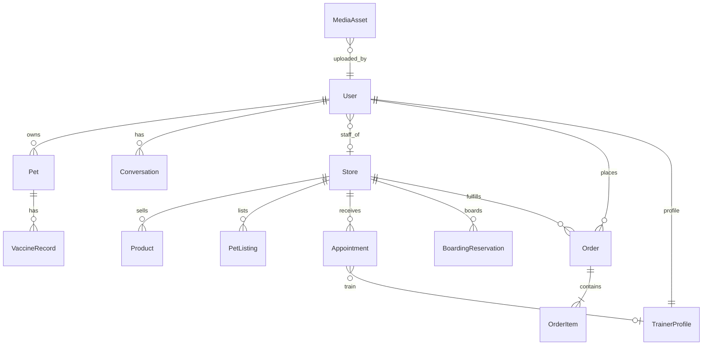

# 宠智联（pet_manage）— 项目最终说明

> **版本**：最终交付版 · 2026-09-25  
> **仓库**：[github.com/liu-yi-peng04/pet_manage](https://github.com/liu-yi-peng04/pet_manage)  
> **定位**：连接养宠用户、宠物店、宠物医院、训犬师与运营者的多边 AI 服务平台。  
> 平台**不自营**商品与待售宠库存；各端 AI 会话按角色隔离。

本文档为项目**唯一权威说明**（架构、业务、启动、账号）。根目录 `README.md` 仅作快速入口。

---

## 1. 一句话架构

```text
Vue3 前端 (:5173)
    │  JWT Bearer + REST / SSE
    ▼
FastAPI (:8000)
    ├── 认证鉴权（user / staff / admin / operator / trainer）
    ├── 业务 API（宠物、商城、预约、订单、选宠、工作台、媒体…）
    ├── AI Agent（RAG + 工具调用 + DeepSeek 流式）
    └── 存储
         ├── MySQL（业务数据 + 图片 Base64）
         └── Milvus（知识库向量）
```

前后端通过 HTTP REST 与 SSE 通信（**无 WebSocket**）；闭环依赖共享 MySQL + 工作台轮询。

---

## 2. 系统总览



---

## 3. 角色与能力

| 角色 | 演示账号 | 主入口 | 能做 | 不能做 |
|------|----------|--------|------|--------|
| 养宠用户 `user` | `demo_user` | 首页 / AI 顾问 | 档案、选宠、商城、预约、订单 | 管店、上架 |
| 宠物店 `staff` + shop | `storeA_mgr` / `storeA_staff` | 门店工作台 | 待售宠、寄养、预约、商品订单、店内 AI | 「我的宠物」、主动下预约 |
| 医院 `staff` + hospital | `hospital_mgr` / `storeB_mgr` | 医院工作台 | 接收就诊预约（弹窗） | 店员层级、售宠（按店型） |
| 训犬师 `trainer` | `trainer_demo` | 预约接收台 | 接单、主页、经历/证书/证明图 | 专属 AI、门店库存 |
| 超管 `admin` | `admin` | 平台工作台 | 公共知识库、运营 | 替商家上架商品 |
| 运营 `operator` | 自助注册 | 运营台 | 线索匹配 | 门店履约 |

密码：除超管 `admin123` 外均为 `Passw0rd!a`。

### AI 隔离

- `Conversation.channel`：`user` / `staff` / `admin`（等）互不可见  
- 前端按 `userId + channel` 分桶持久化会话  

训犬师**不单独做 AI**；用户侧顾问可将行为问题导流到训犬师市场。

---

## 4. 核心业务（已实现）

### 4.1 选宠

商家工作台上架 `PetListing` → 用户在选宠市场浏览 →「预约看宠」进预约到店。

### 4.2 商城订单

```text
pending → accepted → preparing → delivering → completed
         ↘ cancelled
```

一单一店；门店工作台轮询新单（约 8s）+ 语音提醒。

### 4.3 预约

| 类型 | 接收方 |
|------|--------|
| exam 就诊 | 医院 |
| grooming 美容 / boarding 寄养 | 宠物店 |
| consult 咨询 | 医院或店 |
| train 训练 | **训犬师**（`trainer_id`，不绑门店） |

用户发起 → 对方确认/婉拒/完成 → 用户在「我的预约」看状态。

### 4.4 训犬师信任材料

主页字段：简介、`experience` 从业经历、`cert_note` 资质、`avatar_url` 头像、`proof_images` 证明图（最多 8 张，经 `/api/media`）。  
保存时至少填写经历或上传证明图之一。

### 4.5 疫苗中转

宠物店可代用户发起接种预约，推送到指定医院工作台（店只做中转，不履约接种）。

### 4.6 AI 顾问

`POST /api/chat/stream`（SSE）→ Agent → 工具（RAG / 档案 / 资源匹配 / 线索 / Tavily）→ DeepSeek。  
用户端文案不暴露「闭环 / 工作台推送」等内部业务话术。

---

## 5. 数据模型概览



| 存储 | 内容 |
|------|------|
| MySQL | 用户、门店、档案、商品、订单、预约、寄养、会话、线索、MediaAsset |
| Milvus | 文档向量，回指 `kb_id` / `doc_id` |
| uploads/ | 知识库原始文件 |

图片 URL：`/api/media/{id}`。

---

## 6. 目录与文档约定

```text
pet_manage/
├── README.md              # 快速入口
├── docs/
│   ├── README.md          # 文档索引
│   ├── 最终说明.md        # ← 本文（权威）
│   └── archive/           # 过时草稿归档，勿当现行设计
├── backend/               # FastAPI
├── frontend/              # Vue3
├── kb_docs_pet/           # 养宠公共语料（导入知识库用）
├── kb_docs/               # 第三方参考语料（LangChain 等，非产品设计）
└── docker-compose.yml
```

**不算项目设计文档**：`kb_docs/`、`kb_docs_pet/`（RAG 语料）、`cs-agent-design/` / `pet-health-design/`（早期 HTML 设计稿）。

---

## 7. 主要 API

| 前缀 | 说明 |
|------|------|
| `/api/auth` | 注册登录、me |
| `/api/chat` | 流式问答，channel 隔离 |
| `/api/pets` | 用户宠物档案与健康 |
| `/api/stores` | 门店与商品 |
| `/api/orders` | 下单与履约 |
| `/api/booking` | 预约 / 寄养；训犬师收件箱 |
| `/api/workspace` | 店/医院工作台 |
| `/api/listings` `/api/trainers` | 选宠、训犬师主页 |
| `/api/media` | 图片上传读取 |
| `/api/kb` `/api/documents` | 知识库 |

交互细节与 OpenAPI：http://127.0.0.1:8000/docs

---

## 8. 本地启动

```bash
# 后端 :8000（需配置 backend/.env：数据库、DeepSeek、可选 Tavily）
cd backend
.\.venv\Scripts\python.exe -m uvicorn app.main:app --reload --host 127.0.0.1 --port 8000

# 前端 :5173（Vite 将 /api 代理到后端）
cd frontend
npm run dev
```

- 前端：http://localhost:5173/  
- 密钥文件 `backend/.env` **不入库**，需本地自备  

换机重装依赖：

```bash
cd backend && python -m venv .venv && .\.venv\Scripts\pip install -r requirements.txt
cd frontend && npm ci
```

---

## 9. 产品约束（终版）

1. 平台撮合，不自营库存  
2. 用户发起预约/下单；商家、医院、训犬师只接收与履约  
3. 商家无「我的宠物」，仅有待售与客户寄养  
4. 医院一人一账号，无职工层级  
5. AI 按端隔离；训犬师不做专属 AI  
6. 超管不上架商品  
7. 用户端不展示内部业务流程图文案  

---

## 10. 修订记录

| 日期 | 说明 |
|------|------|
| 2026-09-24 | 多边平台架构定稿，替换阶段设计稿 |
| 2026-09-25 | 训犬师预约接收 + 经历/证明图；用户端文案收敛；文档合并为本《最终说明》 |
